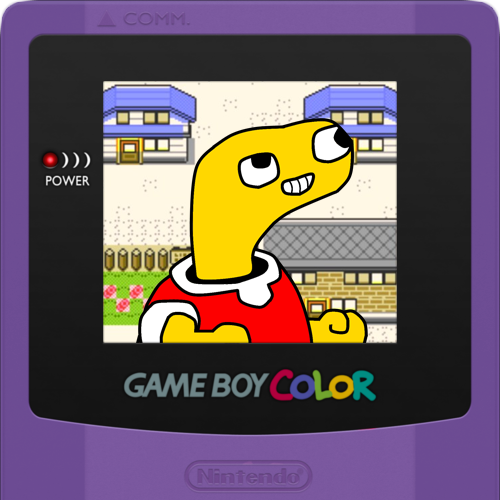
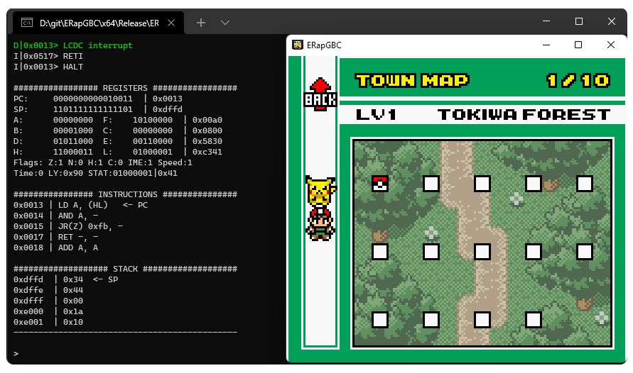

#  ERapGBC

ERapGBC is a Game Boy Color emulator written in C++.

This is not intended to be completely functional at this time: it's just a personal project to study emulators development and understand how the Game Boy Color hardware works.

[SFML](https://www.sfml-dev.org/) is used for rendering. Apart from that, all remaining code has been written from scratch by reading manuals that describe the hardware.
Many inconsistencies have been debugged by comparing this program's output with the one of [bgb](https://bgb.bircd.org/).

## Screenshots

